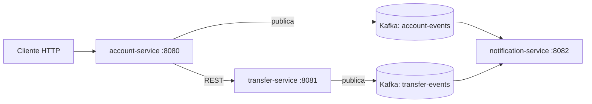

# Event-Driven Banking

Sistema bancário baseado em microsserviços, com Java 21, Spring Boot, Apache Kafka e PostgreSQL. Demonstra arquitetura orientada a eventos, comunicação assíncrona e padrões de sistemas distribuídos.

> 🚧 **Status:** em desenvolvimento. O fluxo principal (contas, transferências e histórico de eventos) funciona; DLQ/retry e testes de integração estão no [roadmap](#roadmap).

## Arquitetura



## Microsserviços

| Serviço | Porta | Banco | Responsabilidade |
|---|---|---|---|
| account-service | 8080 | accounts-db:5432 | Gestão de contas e saldos |
| transfer-service | 8081 | transfers-db:5433 | Transferências com idempotência |
| notification-service | 8082 | notifications-db:5434 | Consumo de eventos e histórico |

## Stack

Java 21 · Spring Boot 4 · Apache Kafka · PostgreSQL 16 (um banco por serviço) · Flyway · Docker Compose · GitHub Actions · Lombok

## Funcionalidades

- [x] Arquitetura orientada a eventos com Kafka
- [x] Transferências idempotentes (sem processamento duplicado)
- [x] Padrão database-per-service
- [x] Eventos de domínio (`AccountCreated`, `TransferCompleted`)
- [x] Migrations com Flyway
- [x] CI com GitHub Actions (build e testes)
- [ ] Dead Letter Queue e retry (em andamento)
- [ ] Testes de integração com Testcontainers (em andamento)

## Como rodar

Pré-requisitos: Java 21, Maven e Docker.

```bash
# 1. Sobe Kafka, Zookeeper e os 3 bancos
docker-compose up -d

# 2. Em um terminal separado para cada serviço:
cd account-service && ./mvnw spring-boot:run
cd transfer-service && ./mvnw spring-boot:run
cd notification-service && ./mvnw spring-boot:run
```

## Testes

```bash
mvn -B test
```

## API

**account-service** · `http://localhost:8080`

| Método | Rota | Descrição |
|---|---|---|
| POST | /accounts | Cria uma conta |
| GET | /accounts | Lista as contas |
| GET | /accounts/{id} | Busca por ID |
| GET | /accounts/cpf/{cpf} | Busca por CPF |
| PATCH | /accounts/{id}/balance | Atualiza o saldo |

**transfer-service** · `http://localhost:8081`

| Método | Rota | Descrição |
|---|---|---|
| POST | /transfers | Cria uma transferência |
| GET | /transfers | Lista as transferências |
| GET | /transfers/{id} | Busca por ID |

## Estrutura

```
event-driven-banking/
├── account-service/
├── transfer-service/
├── notification-service/
├── docker-compose.yml
└── pom.xml
```

## Roadmap

- [ ] Dead Letter Queue e retry nos consumidores
- [ ] Testes de integração com Testcontainers
- [ ] Atualizar para Spring Boot 4

## Desenvolvido por

João Victor · [GitHub](https://github.com/nevvesdev) · [LinkedIn](https://www.linkedin.com/in/nevvesdev/)
